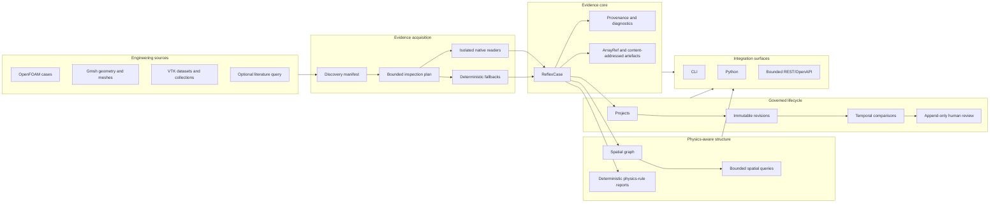
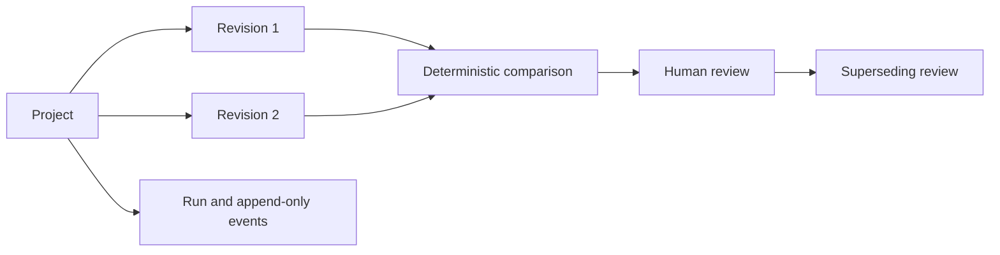

<h1 align="center">CaeReflex</h1>

<h3 align="center">The Missing Middleware between CAE and LLMs</h3>

<p align="center"><strong>Turn simulation artefacts into deterministic, provenance-preserving evidence that AI systems can inspect, query, compare, and cite.</strong></p>

<p align="center">
  
  
  
  
  
  
  
  
</p>

<p align="center">
  <a href="#ten-minute-start"><strong>Quickstart</strong></a>
  &nbsp;&middot;&nbsp;
  <a href="#system-architecture"><strong>Architecture</strong></a>
  &nbsp;&middot;&nbsp;
  <a href="#the-platform-stack"><strong>Platform stack</strong></a>
  &nbsp;&middot;&nbsp;
  <a href="#cli-reference"><strong>CLI</strong></a>
  &nbsp;&middot;&nbsp;
  <a href="#restopenapi-service"><strong>REST/OpenAPI</strong></a>
  &nbsp;&middot;&nbsp;
  <a href="#security-model"><strong>Security</strong></a>
  &nbsp;&middot;&nbsp;
  <a href="#licence"><strong>Commercial licensing</strong></a>
</p>

---

> **Raw simulation files are not AI context.** CaeReflex converts CAE work into governed, machine-readable evidence—without running solvers, mutating source cases, or forcing heavy numerical arrays into model context windows.

CaeReflex connects computer-aided engineering workflows to physics-aware AI systems. It inspects solver cases, meshes, fields, spatial relationships, dimensional evidence, literature metadata, revision history, and human review; then exposes the result through versioned contracts, Python, CLI, and a bounded REST/OpenAPI service.

## At a glance

| **INSPECT** | **STRUCTURE** | **REASON** | **GOVERN** |
| :--- | :--- | :--- | :--- |
| Native, read-only evidence extraction from supported CAE formats | ReflexCase, lazy arrays, spatial graphs, provenance, and diagnostics | Deterministic dimensional and physics-consistency checks | Immutable revisions, temporal comparisons, run histories, and append-only review |

| Leadership view | Platform view | Engineering view |
| --- | --- | --- |
| A horizontal infrastructure layer between simulation software and physics-aware AI. | A bounded evidence service that can sit inside model, agent, digital-engineering, and R&D platforms. | Native readers, typed contracts, lazy heavy-data access, spatial queries, rule packs, and governed lifecycle from one toolchain. |

## Why this infrastructure matters

Simulation intelligence is usually trapped inside folders, solver conventions, binary-heavy datasets, scripts, and expert memory. An AI system may receive a screenshot, copied log, or verbal summary, but not the structured evidence required to distinguish:

- what was actually present in the engineering files;
- what was decoded exactly, inferred, user-supplied, conflicted, or unavailable;
- which coordinate frame, field association, unit, time step, and source path applies;
- what changed between two engineering revisions;
- which checks passed, failed, were blocked, or could not be evaluated;
- what a human reviewer accepted, rejected, conditioned, or superseded; and
- which conclusions remain outside the recorded evidence.

> **CaeReflex is not another model. It is the evidence substrate models need before they can operate responsibly on CAE.**

### Designed for organisations building

| Physics-aware AI | Simulation intelligence | Digital engineering | Governed R&D automation |
| --- | --- | --- | --- |
| Foundation models, engineering copilots, tool-using agents, and scientific reasoning systems | Search, review, comparison, and knowledge layers over simulation estates | Digital twins, design-space exploration, optimisation workflows, and model-based engineering | Internal platforms that require provenance, bounded execution, immutable evidence, and human control |

## System architecture



## The platform stack

| Layer | Capability | Primary output |
| --- | --- | --- |
| Discovery | Bounded workspace cataloguing, format detection, adapter probing, and incremental manifest diffs | `CaseManifest` |
| Inspection | Read-only Gmsh, OpenFOAM, and VTK inspection with explicit parser attempts and fallbacks | `ReflexCase` |
| Native evidence | Isolated backends for supported geometry, mesh, topology, field, and time metadata | `InspectionExecutionResult` |
| Heavy data | Content-addressed artefacts and lazy bounded numerical access | `ArrayRef` |
| Units | Seven-component dimensional evidence, parsing, conversion, and compatibility checks | quantity evidence and dimensional checks |
| Spatial evidence | Backend-neutral entities, coordinate frames, relations, bounds, and array links | persisted spatial graph |
| Spatial queries | Bounded entity, relation, neighbourhood, bounds, frame, and array-link queries | deterministic query result |
| Physics checks | Versioned deterministic rules with evidence pointers, limitations, remediation, and six-valued outcomes | `RuleEvaluationReport` |
| Literature | Explicitly requested DOI metadata and available abstracts | literature evidence and BibTeX |
| Lifecycle | Projects, immutable revisions, restricted runs, and append-only events | lifecycle records |
| Temporal review | Deterministic revision comparison using exact JSON-pointer paths | `TemporalComparison` |
| Human control | Append-only decisions with supersession and digest chaining | `HumanReviewRecord` |
| Services | Synchronous evidence endpoints and bounded local asynchronous jobs | REST/OpenAPI responses |

## Infrastructure characteristics

| Characteristic | Why it matters |
| --- | --- |
| **Deterministic** | Stable ordering, versioned contracts, explicit states, canonical digests, and fail-closed behaviour make outputs testable and comparable. |
| **Evidence-preserving** | Every material claim can retain provenance, source paths, evidence state, diagnostics, and missing-evidence records. |
| **Heavy-data aware** | Large coordinates, connectivity, and field arrays remain outside prompt payloads behind verified, bounded handles. |
| **Backend-neutral** | Native formats map into common evidence and spatial contracts without asserting false cross-format equivalence. |
| **Governed** | Immutable snapshots, restricted state transitions, temporal diffs, and append-only review preserve operational history. |
| **Bounded** | Filesystem scope, scanning, worker time, output size, arrays, queries, request bodies, queues, and lists have explicit limits. |
| **Extensible** | Adapter entry points, rule packs, service contracts, and independent protocol versions provide controlled expansion surfaces. |
| **Local-first** | Ordinary inspection stays local; external literature calls are explicit and raw simulation files are not transmitted. |

## What CaeReflex is — and is not

CaeReflex is an **inspection, evidence, provenance, and workflow-control system** for simulation artefacts.

It is not a solver, mesher, CAD repair tool, visualisation engine, optimisation engine, simulation validator, certification system, convergence proof, mesh-adequacy assessor, or autonomous engineering decision-maker.

> **Safety boundary:** a `consistent` rule result means that the recorded evidence satisfied that rule. It does not establish numerical accuracy, physical validity, convergence, mesh independence, experimental validation, regulatory compliance, certification, or design safety.

## Ten-minute start

### 1. Install

```bash
git clone https://github.com/KNOWDYN/CaeReflex.git
cd CaeReflex

python -m venv .venv
source .venv/bin/activate
# Windows PowerShell: .venv\Scripts\Activate.ps1

python -m pip install --upgrade pip
pip install -e ".[server]"
```

Optional native-reader dependencies:

```bash
pip install -e ".[mesh]"   # NumPy + meshio
pip install -e ".[vtk]"    # PyVista + VTK
pip install -e ".[gmsh]"   # Gmsh Python API
pip install -e ".[all,dev]"
```

### 2. Check the environment

```bash
caereflex version
caereflex doctor
caereflex adapters list
caereflex execution backends
```

### 3. Inspect a case

```bash
caereflex inspect examples/openfoam_cavity_minimal \
  --profile deep \
  --out caereflex.json \
  --manifest-out manifest.json \
  --agent-context agent_context.json \
  --report case_report.md
```

This produces a full `ReflexCase`, discovery manifest, compact AI-ready context, and human-readable report. With `deep` or `forensic`, supported cases also pass through an isolated native backend and may create spatial evidence and lazy array references.

### 4. Evaluate deterministic physics rules

```bash
caereflex physics evaluate-openfoam \
  --case caereflex.json \
  --out physics_report.json
```

The initial OpenFOAM CFD pack checks velocity, pressure, and viscosity dimensions; mesh face accounting; boundary-patch coverage; and field association. Missing evidence never becomes a pass.

### 5. Create a governed revision

```bash
caereflex lifecycle project-create "Pump study"
# Copy the returned project_id.

caereflex lifecycle revision-create PROJECT_ID \
  --case caereflex.json \
  --label baseline
```

Repeat the inspection after a design or setup change, create a second revision, then compare:

```bash
caereflex lifecycle compare \
  PROJECT_ID \
  BASELINE_REVISION_ID \
  CANDIDATE_REVISION_ID \
  --max-changes 200
```

### 6. Start the local service

```bash
caereflex serve \
  --host 127.0.0.1 \
  --port 8765 \
  --workspace .
```

```bash
curl http://127.0.0.1:8765/health
curl http://127.0.0.1:8765/openapi.yaml
```

The service is localhost-first. Binding to a non-localhost address requires an API key.

## Inspection model

### Profiles

| Profile | Purpose |
| --- | --- |
| `catalog` | Bounded discovery and inventory creation |
| `standard` | Core adapter inspection and normalized `ReflexCase` output |
| `deep` | Standard inspection plus isolated native execution where supported |
| `forensic` | Native execution path for the highest-evidence inspection workflow currently supported by the selected backend |

Inspection remains read-only at every profile. Adapter and backend support determines what can be decoded; unsupported grammar becomes explicit diagnostics or fallback evidence rather than an invented result.

### Built-in adapters

#### OpenFOAM

CaeReflex can inspect case structure, dictionaries, `polyMesh` data, time directories, and supported ASCII fields. The native backend decodes bounded forms of:

- points and bounds;
- faces, owner, neighbour, and boundary records;
- cell, internal-face, and boundary-face counts;
- boundary-patch ranges;
- uniform and non-uniform scalar, vector, and common tensor internal fields;
- field classes, associations, and seven-component dimension vectors; and
- field availability across time directories.

It does not execute OpenFOAM, load solver libraries, expand code streams, or modify a case. Binary, directive-bearing, and unsupported inputs fall back with diagnostics.

#### Gmsh

Supported evidence paths include:

- declaration-only `.geo` inspection;
- dependency-free bounded ASCII reading for MSH 2.x and 4.x;
- optional `meshio` reading;
- nodes, elements, entities, physical groups, bounds, and field records;
- optional explicit Gmsh API inspection for selected CAD formats; and
- fingerprint-only handling for STEP, IGES, and BREP by default.

The `.geo` path does not invoke Gmsh or execute scripts. Includes, loops, functions, system calls, extrusions, and boolean operations remain unresolved unless supported by a separately controlled path. The optional API path does not request mesh generation.

#### VTK

Supported extensions include legacy VTK, XML datasets, parallel metadata, and collection formats:

`.vtk`, `.vtu`, `.vtp`, `.vti`, `.vtr`, `.vts`, `.pvtu`, `.pvtp`, `.pvti`, `.pvtr`, `.pvts`, `.pvd`, `.vtm`, and `.vtmb`.

Evidence may include:

- points, bounds, structured extents, and rectilinear coordinates;
- connectivity, offsets, and cell types;
- point, cell, and field data through lazy array references;
- collection references and time values; and
- ordered PyVista/VTK, `meshio`, core ASCII/XML, and fingerprint fallbacks.

Collection and parallel references are inventoried; external references are not automatically fetched or traversed.

### Adapter plugins

Additional adapters can be registered through the Python entry-point group:

```text
caereflex.adapters
```

Each plugin declares formats, geometry/topology/field support, units behaviour, optional dependencies, fallback modes, network requirements, and source-execution requirements.

## Evidence and data contracts

CaeReflex keeps compact evidence in JSON and heavy numerical payloads behind verified handles.

### Primary records

| Record | Role |
| --- | --- |
| `ReflexCase` | Normalized case identity, evidence, diagnostics, provenance, summaries, and references |
| `CaseManifest` | Bounded inventory of selected workspace paths and format hints |
| `InspectionPlan` | Explicit selected paths, profile, backend candidates, and budgets |
| `InspectionExecutionResult` | Backend identity, attempts, diagnostics, artefacts, arrays, status, and source-mutation evidence |
| `ArrayRef` | Lazy handle carrying shape, type, checksum, association, backend, time, frame, and permitted operations |
| `SpatialGraphSnapshot` | Compact entities, frames, relations, bounds, and array links |
| `RuleEvaluationReport` | Versioned rule outcomes, exact evidence pointers, missing evidence, remediation, and digests |
| `RevisionRecord` | Immutable canonical `ReflexCase` snapshot with SHA-256 digest |
| `TemporalComparison` | Deterministic structural changes between verified revisions |
| `HumanReviewRecord` | Append-only decision and statement linked to recorded evidence |

<details>
<summary><strong>Current protocol versions</strong></summary>

| Contract | Version |
| --- | --- |
| Package | `2.0.0b6` |
| ReflexCase schema | `1.0` |
| Backend-neutral inspection contract | `2.0-alpha.3` |
| Gate 5 backend-result envelope | `caereflex.gate5.backend-result/1.0` |
| Spatial graph | `1.0` |
| Spatial mapping | `caereflex.spatial-mapping/1.0` |
| Spatial query | `caereflex.spatial-query/1.0` |
| Gate 6 spatial acceptance | `caereflex.gate6.spatial/1.0` |
| Physics-rule protocol | `caereflex.physics-rule/1.0` |
| OpenFOAM CFD rule pack | `caereflex.openfoam-cfd/1.0.0` |
| Project/revision/run lifecycle | `caereflex.lifecycle/1.0` |
| Temporal comparison | `caereflex.temporal-comparison/1.0` |
| Human review | `caereflex.human-review/1.0` |
| Asynchronous jobs | `caereflex.async-job/1.0` |

</details>

## Heavy arrays without prompt inflation

Large coordinates, connectivity, field values, memberships, and topology arrays are stored in the local content-addressed artefact store rather than embedded in `ReflexCase` JSON.

`ArrayRef` exposes metadata and permitted operations. The CLI provides bounded access:

```bash
caereflex arrays list
caereflex arrays describe ARRAY_ID
caereflex arrays sample ARRAY_ID --count 100
caereflex arrays slice ARRAY_ID --start 0 --stop 100
caereflex arrays reduce ARRAY_ID --operation mean
```

Returned element counts are bounded, slices are checked, and reductions stream over the artefact rather than materialising an unrestricted array in JSON.

## Spatial evidence

Native OpenFOAM, Gmsh, and VTK evidence can be mapped into a backend-neutral spatial graph. The graph separates geometry, mesh, grouping, and dataset identities and records coordinate-frame evidence without assuming global axes, metres, zero origins, handedness, or cross-format equivalence.

Heavy coordinates and connectivity stay behind `ArrayRef` links.

```bash
caereflex spatial version
caereflex spatial graphs --case-id CASE_ID
caereflex spatial show GRAPH_ID
caereflex spatial frames GRAPH_ID
caereflex spatial entities GRAPH_ID --kinds mesh_cell,mesh_face
caereflex spatial relations GRAPH_ID --entity-id ENTITY_ID
caereflex spatial neighbours GRAPH_ID ENTITY_ID --depth 2
caereflex spatial bounds GRAPH_ID \
  --frame-id FRAME_ID \
  --minimum "0,0,0" \
  --maximum "1,1,1"
caereflex spatial arrays GRAPH_ID
caereflex spatial validate GRAPH_ID
```

Spatial queries are read-only and bounded. They use recorded relations and same-frame bounds; they do not invent adjacency, compose unresolved transforms, infer units, or assert cross-format equivalence.

## Deterministic physics-consistency rules

Every rule declares identity, version, applicability, required evidence, assumptions, limitations, severity, evidence pointers, remediation, and deterministic result semantics.

The six possible outcomes are:

`consistent`, `inconsistent`, `unknown`, `not_applicable`, `not_evaluated`, and `blocked`.

```bash
caereflex physics version
caereflex physics evaluate-openfoam --case caereflex.json
```

Rule reports include input and report digests. Malformed required evidence and internal rule exceptions fail closed as `blocked`.

## Project, revision, run, and review lifecycle



Key properties:

- project-local revision sequences and parent links;
- canonical JSON snapshots verified by SHA-256;
- restricted run transitions and append-only events;
- terminal runs cannot be reopened;
- volatile timestamps are ignored by default during comparison;
- changes use exact JSON-pointer paths;
- detailed comparisons are bounded and explicitly marked when truncated;
- review rows cannot be updated or deleted; and
- optional signature metadata is preserved but not independently authenticated.

```bash
caereflex lifecycle version
caereflex lifecycle project-list
caereflex lifecycle project-show PROJECT_ID
caereflex lifecycle revision-list PROJECT_ID
caereflex lifecycle revision-show REVISION_ID --include-case
caereflex lifecycle run-list PROJECT_ID
caereflex lifecycle run-show RUN_ID
caereflex lifecycle review-list PROJECT_ID
```

## CLI reference

| Command group | Operations |
| --- | --- |
| Core | `version`, `doctor`, `scan`, `inspect`, `serve` |
| Adapters | `adapters list`, `adapters info`, `adapters probe` |
| Units | `units parse`, `units convert`, `units check` |
| Execution | `execution backends`, `execution run` |
| Arrays | `arrays list`, `arrays describe`, `arrays sample`, `arrays slice`, `arrays reduce` |
| Spatial | `spatial version`, `graphs`, `show`, `frames`, `entities`, `relations`, `neighbours`, `bounds`, `arrays`, `validate` |
| Physics | `physics version`, `physics evaluate-openfoam` |
| Lifecycle | `lifecycle version`, project, revision, run, comparison, and review commands |
| Jobs | `jobs list`, `jobs show` |
| Literature | `crossref search`, `crossref attach` |
| Export | `export agent-context`, `export markdown`, `export bibtex` |
| Schema | `schema show`, `schema validate` |
| Diagnostics | `diagnostics list`, `diagnostics explain` |
| Cache | `cache clean` |
| Examples | `examples list`, `examples run` |

Use `caereflex COMMAND --help` or `caereflex GROUP COMMAND --help` for complete options and limits.

## Python API

```python
from pathlib import Path

from caereflex.contracts import InspectionProfile
from caereflex.services import export_case, inspect_path, save_case

source = Path("examples/openfoam_cavity_minimal")

case = inspect_path(
    source,
    adapter="auto",
    profile=InspectionProfile.deep,
)

save_case(case, "caereflex.json")
export_case(case, "agent-context", "agent_context.json")
export_case(case, "markdown", "case_report.md")
```

Lifecycle and comparison example:

```python
from caereflex.lifecycle import LifecycleStore, compare_revisions
from caereflex.services import load_case

store = LifecycleStore(".caereflex")
project = store.create_project("Pump study")

baseline_case = load_case("baseline.caereflex.json")
candidate_case = load_case("candidate.caereflex.json")

baseline = store.create_revision(project.project_id, baseline_case.model_dump(mode="json"))
candidate = store.create_revision(project.project_id, candidate_case.model_dump(mode="json"))

comparison = compare_revisions(
    store,
    project.project_id,
    baseline.revision_id,
    candidate.revision_id,
)
```

## REST/OpenAPI service

Install the server extra and start a workspace-bound service:

```bash
pip install -e ".[server]"

caereflex serve \
  --host 127.0.0.1 \
  --port 8765 \
  --workspace /trusted/engineering/workspace
```

For a non-localhost bind:

```bash
caereflex serve \
  --host 0.0.0.0 \
  --port 8765 \
  --workspace /trusted/engineering/workspace \
  --api-key "$CAEREFLEX_API_KEY"
```

The server exposes its generated schema at `/openapi.yaml`.

### Endpoint groups

| Group | Endpoints |
| --- | --- |
| Service | `GET /health`, `GET /version`, `GET /lifecycle/version`, `GET /openapi.yaml` |
| Cases | `POST /cases/import`, `GET /cases`, `GET /cases/{case_id}`, summary, agent-context, literature, and inspection-flags endpoints |
| Literature | case-scoped CrossRef search and attach |
| Export | case-scoped JSON, Markdown, and BibTeX export |
| Projects | create, list, retrieve, and archive |
| Revisions | create/list by project and retrieve by revision |
| Runs | list by project and retrieve with append-only events |
| Comparisons | create and retrieve |
| Reviews | create and filtered list |
| Jobs | submit inspection/comparison, list, and retrieve |

### Service bounds

Defaults and hard limits include:

- request body: 1 MiB default; configurable between 1 KiB and 10 MiB;
- list responses: at most 100 records through REST;
- CrossRef result limit: at most 50;
- comparison details: at most 500 changes;
- asynchronous workers: 1–8;
- queued jobs: 0–128;
- options: at most 32 keys;
- metadata: bounded key count and serialized size; and
- every REST filesystem path must remain inside the configured workspace.

The asynchronous executor is local and in-process, not a distributed queue. Pending or running lifecycle jobs left by a stopped service are failed closed during recovery rather than silently resumed.

## Literature evidence

Literature lookup is opt-in. Ordinary discovery, inspection, spatial queries, rules, lifecycle operations, and exports do not make hidden literature-service calls.

```bash
caereflex crossref search caereflex.json \
  --query "lid driven cavity CFD" \
  --limit 5 \
  --out literature.json

caereflex crossref attach caereflex.json \
  --query "lid driven cavity CFD" \
  --limit 5 \
  --out caereflex.with_literature.json

caereflex export bibtex caereflex.with_literature.json \
  --out references.bib
```

Only generated or user-supplied query strings and API parameters are sent. Raw simulation files are not transmitted. Returned records are metadata and available abstracts, not proof that a full paper was read or that a simulation is valid.

## Security model

CaeReflex is designed around a narrow, inspectable boundary:

- localhost-first service deployment;
- mandatory API key for non-localhost binding;
- workspace-contained REST paths;
- bounded scanning, execution time, result size, request size, arrays, and queries;
- sanitised deep-execution environment by default;
- network and child-process guards in the Python worker;
- before-and-after source snapshots;
- content-addressed artefacts with integrity verification;
- explicit parser attempts and fallbacks;
- no solver, mesher, shell, visualisation-pipeline, or source-mutation endpoints; and
- no hidden external literature calls.

The worker is **not a complete operating-system sandbox**. Native libraries can bypass Python-level controls. Untrusted, proprietary, regulated, or safety-critical inputs may require a container, virtual machine, restricted operating-system account, or institutionally managed worker.

See [SECURITY.md](SECURITY.md) for the full security boundary and responsible-disclosure process.

## Deployment patterns

CaeReflex can serve as:

- a workstation tool for inspecting individual simulation cases;
- an evidence-preparation stage for physics-aware AI systems;
- a local or internal REST service for engineering tools;
- a provenance layer for simulation-data pipelines;
- a deterministic pre-check layer before human review;
- a revision and review ledger for model-development workflows; or
- an adapter framework for additional engineering formats.

Production, multi-user, cloud, regulated, or safety-critical deployment requires additional identity, authorization, HTTPS termination, isolation, logging, observability, secrets management, and operational controls. CaeReflex does not provide OAuth, RBAC, tenant isolation, or a hosted platform boundary.

## Repository map

| Path | Contents |
| --- | --- |
| `caereflex/` | Package source |
| `caereflex/adapters/` | Core format adapters |
| `caereflex/execution/` | Isolated execution runtime and backends |
| `caereflex/spatial/` | Spatial contracts, mapping, persistence, queries, and acceptance checks |
| `caereflex/physics/` | Physics-rule protocol and rule packs |
| `caereflex/lifecycle/` | Projects, revisions, runs, comparisons, reviews, and async jobs |
| `openapi/` | Generated JSON and YAML API contracts |
| `examples/` | Small offline example cases and mock literature data |
| `tests/` | Core, optional-backend, gate, compatibility, and malformed-input tests |
| `docs/` | Gate specifications and compact reference documents |
| `wiki/docs/` | User guides, learning projects, architecture, developer, security, and release documentation |

### Documentation

- [Installation](wiki/docs/user-guide/install.md)
- [Quickstart](wiki/docs/user-guide/quickstart.md)
- [Safe execution and arrays](wiki/docs/user-guide/safe-execution-and-arrays.md)
- [Native OpenFOAM inspection](wiki/docs/user-guide/native-openfoam-inspection.md)
- [Native Gmsh inspection](wiki/docs/user-guide/native-gmsh-inspection.md)
- [Native VTK inspection](wiki/docs/user-guide/native-vtk-inspection.md)
- [Spatial queries](wiki/docs/user-guide/spatial-queries.md)
- [Architecture overview](wiki/docs/architecture/index.md)
- [REST API architecture](wiki/docs/architecture/rest-api.md)
- [CLI reference](wiki/docs/reference/cli.md)
- [OpenAPI reference](wiki/docs/reference/openapi.md)
- [Licensing reference](wiki/docs/reference/licensing.md)

## Testing and release controls

The repository maintains separate checks for:

- deterministic core behaviour across Python 3.10, 3.11, and 3.12;
- optional Gmsh and VTK dependencies;
- native-reader compatibility;
- malformed-input and fault-injection behaviour;
- spatial acceptance;
- physics-rule determinism; and
- lifecycle, immutable review, asynchronous jobs, and bounded REST services.

The checked-in OpenAPI documents, package metadata, citation metadata, changelog, and release documentation are validated against the package version.

## Licence

CaeReflex is **source-available**, not OSI-approved open-source software.

Academic research, teaching, coursework, non-commercial reproducibility, and non-commercial evaluation are permitted subject to the [CaeReflex Research Source Licence](LICENSE.md). Commercial use—including internal commercial R&D, paid services, production systems, commercial agent workflows, APIs, hosted services, and incorporation into products—requires a separate paid commercial licence.

**Commercial licensing and permissions:** [ipcontrol@knowdyn.co.uk](mailto:ipcontrol@knowdyn.co.uk)

- [Academic use](ACADEMIC_USE.md)
- [Commercial licensing](COMMERCIAL_LICENSE.md)
- [Third-party notices](THIRD_PARTY_NOTICES.md)
- [Citation metadata](CITATION.cff)

## Responsible use

CaeReflex output must remain evidence, not authority. Qualified engineers remain responsible for verification, validation, convergence assessment, mesh studies, experiments, regulatory interpretation, design decisions, and professional sign-off.

Report security issues privately using the contact in [SECURITY.md](SECURITY.md).
